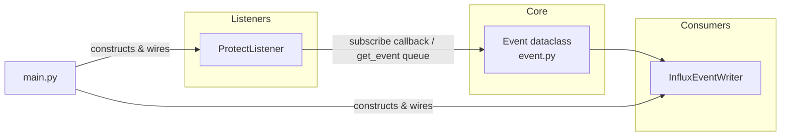

# Home Event Framework — Handoff Notes

Written for another AI agent picking up this project. You know the Unraid/Home
Assistant side much better than I do — this doc focuses on what was built here,
why, and how to extend it. Deployment/config on the Unraid box and HA side is
your call.

## Purpose

A small Python framework that normalizes activity from various home systems
(cameras, locks, media players, sensors, appliances...) into one common
`Event` record, so downstream consumers (time-series DB, HA, notifications,
etc.) only ever need to understand one shape of data instead of N vendor APIs.

Today there's one listener (UniFi Protect) and one consumer (InfluxDB 2.x),
wired together by a coordinator. More of both are expected over time.

## Intended runtime

- Target: a Home Assistant VM (Linux) on an Unraid server. Not developed or
  tested there yet — everything so far was written/inspected on a Windows dev
  machine and has **not been run**, only statically checked (no syntax/type
  errors reported by Pylance).
- Python 3.11+ (required by `uiprotect`; codebase uses `X | Y` unions,
  `from __future__ import annotations`, etc. throughout).
- Dependencies to install on the target: `uiprotect`, `influxdb-client[async]`.

## Architecture



- **`event.py`** — the shared contract. A single frozen-shape dataclass every
  listener emits and every consumer understands. Nothing else should be
  needed to add a new source or a new sink.
- **`protect_listener.py`** — first listener. Owns a `uiprotect` websocket
  connection to a UniFi Protect controller and turns camera/doorbell/access
  activity into `Event`s.
- **`influx_writer.py`** — first consumer. Writes `Event`s into an InfluxDB
  2.x bucket.
- **`main.py`** — the coordinator. Reads env vars, constructs listener(s) and
  consumer(s), wires them together, runs until `SIGINT`/`SIGTERM`, shuts down
  cleanly.

## `event.py` — the contract

```python
@dataclass
class Event:
    timestamp: datetime
    source: str          # e.g. "protect"
    entity: str           # normalized device/area slug, e.g. "front_door"
    event_type: str        # normalized vocabulary, e.g. "motion", "door_access"
    attributes: dict[str, Any] = field(default_factory=dict)  # free-form extra detail
```

This is deliberately loose (`attributes` is an open dict) so each source can
attach whatever detail makes sense (confidence score, zone ids, media title,
wattage...) without changing the shared schema. Consumers that care about
structure (like `influx_writer.py`) just iterate `attributes.items()` rather
than assuming specific keys exist.

`event notes.txt` in this folder is the user's own working list of likely
future sources/entities/event_types/attributes (Zigbee, Roborock, Plex,
Honeywell thermostat, unifi_lock, etc.) — not implemented, just a roadmap of
vocabulary to stay consistent with when adding future listeners. Worth
reading before inventing new `event_type`/`attributes` names for a new
source, to reuse existing vocabulary where it fits.

## `protect_listener.py` — reference listener implementation

Uses `uiprotect` (maintained successor to `pyunifiprotect`; same library the
official Home Assistant `unifiprotect` integration is built on), talking to
the **private API** (username/password against the controller directly, via
`ProtectApiClient`), not the newer public/API-key surface — the private API
exposes richer smart-detect metadata (zone/line ids, scores) that the public
API doesn't yet have parity for.

Flow:
1. `ProtectListener(host, port, user, pass, ...)` constructs a
   `ProtectApiClient`.
2. `await listener.start()` calls `protect.update()` (loads bootstrap state +
   opens the websocket), logs any camera with no entity mapping, then
   registers `_on_ws_message` via `protect.subscribe_websocket(...)`.
3. Every websocket message is a `WSSubscriptionMessage(action, new_obj,
   old_obj, ...)`. We branch on `type(new_obj)`:
   - `Event` (aliased `ProtectEvent` to avoid name clash with our own
     `Event`) → `_handle_protect_event`: only reacts on `WSAction.ADD` (the
     later `UPDATE` that fills in `end`/score would otherwise double-report
     the same detection); looks up `EventType` → normalized `event_type` via
     `EVENT_TYPE_MAP`; unmapped types are ignored (logged at DEBUG). Kicks
     off `_process_smart_event` as a background `asyncio.Task` (so one slow
     enrichment doesn't block processing the next websocket message).
   - `Camera` → `_handle_camera_state`: diffs `old_obj.state` vs
     `new_obj.state` (`StateType` enum) to emit `camera_online`/
     `camera_offline` (CONNECTING is treated as transient/non-reportable).
4. `_process_smart_event` → `_build_attributes` enriches the event: always
   includes `event_id`; adds `object_type` (comma-joined
   `SmartDetectObjectType` values), `confidence` (score), `thumbnail_path`
   (downloads+saves the thumbnail JPEG via `get_thumbnail()` to
   `thumbnail_dir`, default `./thumbnails/<event_id>.jpg`), and for
   `SMART_DETECT`/`SMART_DETECT_LINE` events, `zone`/`line` id lists (an
   extra API round trip via `get_smart_detect_track()`). Also surfaces
   `reason`/`ulp_id` from `EventMetadata` for G6/G3 Entry access events (NFC
   card / fingerprint) if present.
5. `_emit(event)` is the single fan-out point: pushes onto an internal
   `asyncio.Queue` (backs `get_event()`) and calls every registered
   subscriber callback (backs `subscribe()`). If there are zero subscribers,
   it logs the event at INFO so nothing is silently lost during
   development/debugging.

Two ways to consume events from another module, usable simultaneously:
```python
unsubscribe = listener.subscribe(my_sync_callback)   # push, fan-out to N callbacks
event = await listener.get_event()                     # pull, single asyncio.Queue
```

Camera → entity slug mapping: `DEFAULT_CAMERA_ENTITY_MAP` hardcodes the 10
known camera display names → slugs (case-insensitive match). Anything not in
the map still gets reported using a slugified version of its Protect name
(`slugify()`), so a renamed/new camera is never silently dropped — just logged
as a warning at `start()` so you notice and can add a proper mapping.
Overridable at runtime via the `PROTECT_CAMERA_MAP` env var, format
`"Camera Name=slug;Other Cam=slug2"`, parsed by `parse_camera_map()`.

One specific piece of real-world context baked in: the `front_door` entity is
actually a UniFi G6/G3 Entry (doorbell + NFC/fingerprint access reader), not
a plain camera. Protect still models it as an ordinary `Camera` object (with
`has_fingerprint_sensor`/`support_nfc` flags) and reports its access activity
as ordinary `Event`s tied to that `camera_id` — so no special-casing was
needed structurally, just extra `EventType` entries
(`NFC_CARD_SCANNED`/`FINGERPRINT_IDENTIFIED`/`DOOR_ACCESS`) mapped to
`nfc_scanned`/`fingerprint_identified`/`door_access` event types.

### Known open questions (not yet resolved, flagged rather than guessed)

- **`direction`** attribute (requested in the original attribute wishlist in
  `event notes.txt`) is not exposed anywhere in the verified `uiprotect` API
  surface for smart-detect events — intentionally omitted rather than
  fabricated.
- Whether `nfcCardScanned`/`fingerprintIdentified` events fire only on
  **successful** access or also on denials could not be verified from
  source — currently both are reported identically as `nfc_scanned`/
  `fingerprint_identified` with whatever `reason` Protect attaches. If HA
  needs to distinguish granted vs denied, this needs live testing against
  the real G6 Entry to observe actual payloads.
- `ulp_id` (from `EventMetadata.nfc`/`.fingerprint`) is Protect's internal
  user-profile id, not a resolved person name — no lookup/resolution to a
  human-readable name has been implemented. Would need a separate call
  against Protect's user/NFC-fingerprint management API (not yet
  researched).

### Logging (see module docstring/inline comments for exact call sites)

Logger name `protect_listener`. Nothing configures handlers/output itself —
that's `main.py`'s job (or whatever process supervisor runs it). Notable
DEBUG-level detail available when troubleshooting: every websocket message's
action/type, why an event was skipped (non-ADD action, unmapped EventType),
dispatch confirmations, queue size + subscriber count on every emit. A silent
failure mode that was specifically fixed: `asyncio.create_task()` fire-and
-forget tasks now have a done-callback (`_on_task_done`) that logs any
exception raised inside `_process_smart_event` — without it, enrichment
failures would vanish silently (asyncio only surfaces "Task exception was
never retrieved" unreliably via GC). Setting `LOG_LEVEL=DEBUG` (env var,
read by `main.py`) also bumps `uiprotect`'s own logger to DEBUG, surfacing
the library's internal websocket/reconnect activity in the same log stream.

## `influx_writer.py` — reference consumer implementation

Uses the official `influxdb-client` package's **asyncio-native** client
(`InfluxDBClientAsync`/`WriteApiAsync`, the `[async]` extra — installs
aiohttp) specifically so writes don't block the same event loop the listener
runs on. Must be constructed **inside a running event loop** (the client's
own `__init__` checks for one and raises if there isn't one) — i.e. inside
`main()`, not at module import time.

`InfluxEventWriter.run(source)` is a pull loop: `while True: event = await
source.get_event(); await self.write(event)`. It was deliberately wired to
the listener's `get_event()` queue rather than `subscribe()`, because a
synchronous push callback is the wrong place for a network write — the pull
loop keeps the Influx write fully async and isolated from websocket message
handling.

Data model: one measurement (`home_events`); tags are `source`, `entity`,
`event_type` (all low-cardinality, good for Grafana/Flux `WHERE`/`GROUP BY`);
every entry in `Event.attributes` becomes a **field** (not a tag — shape
varies per event_type, and Influx fields aren't indexed the same way tags
are). A constant `value=1` field is included for cheap `count()` queries. List
-valued attributes (e.g. `zone`/`line` id lists) are flattened to
comma-joined strings since Influx line protocol fields only support
str/int/float/bool (verified against the client's `Point._append_fields`
source — anything else raises `ValueError` when actually serialized, so
`_to_field_value()` sanitizes proactively rather than letting a write fail
outright and drop the whole point).

**Not yet decided/pursued**: Grafana dashboard design, bucket/measurement
naming conventions relative to whatever HA's existing InfluxDB integration
already writes (explicitly deferred by the user — "not worried about Grafana
right now").

## `main.py` — coordinator

Env vars it reads (all consumed here, not inside the listener/writer classes
themselves — those classes take plain constructor args, so they stay
reusable/testable without env coupling):

| Var | Required | Default | Notes |
|---|---|---|---|
| `UFP_ADDRESS` | yes | — | Protect controller host/IP |
| `UFP_PORT` | no | `443` | |
| `UFP_USERNAME` / `UFP_PASSWORD` | yes | — | Protect local account |
| `UFP_SSL_VERIFY` | no | `false` | `"1"/"true"/"yes"` (case-insensitive) to enable |
| `PROTECT_CAMERA_MAP` | no | empty | `"Name=slug;Name2=slug2"` overrides for `DEFAULT_CAMERA_ENTITY_MAP` |
| `INFLUX_URL` / `INFLUX_TOKEN` / `INFLUX_ORG` / `INFLUX_BUCKET` | yes | — | InfluxDB 2.x connection |
| `LOG_LEVEL` | no | `INFO` | also flips `uiprotect`'s logger to DEBUG when set to DEBUG |

Lifecycle: configure logging → construct+start `ProtectListener` → construct
`InfluxEventWriter` → spawn its `run()` pull loop as a background task →
register `SIGINT`/`SIGTERM` handlers (guarded with `try/except
NotImplementedError` since `loop.add_signal_handler` isn't available on
Windows — irrelevant on the real Linux target, just kept dev-machine-safe) →
block on an `asyncio.Event` until signalled → on shutdown, cancel the writer
task, `await listener.stop()`, `await writer.close()`.

## Extending the framework

**Adding a new listener** (e.g. Zigbee, Roborock, a Plex webhook receiver):
1. New module, e.g. `zigbee_listener.py`. Own class analogous to
   `ProtectListener`: owns whatever connection the source needs, translates
   native events into `Event(...)` instances using `event notes.txt`'s
   vocabulary where it already fits (don't invent a new `event_type` for
   something that already has a name there).
2. Give it the same dual consumption API for consistency —
   `subscribe(callback) -> unsubscribe` and `async def get_event() -> Event`
   backed by an `asyncio.Queue` — so it's a drop-in peer to `ProtectListener`
   from `main.py`'s point of view. (Consider factoring a shared base class if
   a third listener repeats this exact boilerplate — two implementations
   isn't yet a strong enough signal to abstract it.)
3. Wire it up in `main.py`: construct + `await .start()` + connect it to
   whichever consumer(s) should see its events (same writer instance can
   consume from multiple sources — just spawn one `writer.run(listener)` task
   per source, or have one task that fans in from multiple `get_event()`
   calls via `asyncio.as_completed`/a merge helper if that becomes
   necessary).

**Adding a new consumer** (e.g. an HA state-setter, a notification sender):
1. New module, class with `async def write(self, event: Event)` (or
   whatever verb fits) plus ideally a `run(source)` pull loop like
   `InfluxEventWriter`, for consistency.
2. Construct + wire it up in `main.py` alongside the existing writer.

## Future: enrichers and an event bus (not built yet)

Two more pieces are planned but not implemented — noted here so the shape
of `event.py`/consumer APIs isn't surprising if a design decision seems to
be leaving room for them.

**Enrichers** sit downstream of the raw listeners and look for patterns
across *multiple* events. Where a listener translates an external system
into a canonical `Event`, an enricher consumes existing `Event`s and
produces *new* `Event`s — it never modifies history. It just observes the
stream and adds new facts derived from existing facts.

Example: Protect emits a person detection at `east_gate`; ~30 seconds later
a (future) Zigbee listener emits a door-open at `laundry_door`. Both raw
events are stored exactly as they occurred. A transition enricher watching
the stream could notice that pairing and emit a new derived event —
something like `arrival_detected` on some `entity` (or a virtual
whole_home-style entity), with attributes noting the inferred path
(`from=east_gate`, `to=laundry_door`) and whatever confidence/timing
detail matters.

This separation is deliberate: enrichment logic (time windows, which
signals to weight, confidence thresholds) will keep changing as it's
tuned. A 60-second arrival window today might become 120 seconds, or start
factoring in detection confidence, six months from now. Because the raw
events are never overwritten or consumed destructively, an improved
enricher can be re-run over history to produce better derived events
without losing (or needing to re-observe) the original raw ones.

**Event bus**: once there are enrichers producing their own events (in
addition to listeners), wiring everything together as direct
constructor/`subscribe()` calls in `main.py` stops scaling — every new
enricher or consumer would need to know about every relevant listener *and*
every other enricher whose output it cares about. A bus decouples this:
listeners publish `Event`s to the bus, consumers (Influx, an archive, a
dashboard) subscribe to read them, and enrichers subscribe to *analyze*
them and publish their derived `Event`s back onto the same bus, where
anything else downstream (including other enrichers) can pick them up —
without a growing web of direct point-to-point dependencies.

Not needed yet: with a single listener and no enrichers, `ProtectListener`'s
own `subscribe()`/`get_event()` is sufficient and `main.py` wiring everything
by hand is simpler than a bus abstraction would be. Revisit this once a
second listener and/or a first enricher are actually being built.

## Status / what's not done yet

- **No runtime testing at all.** Nothing has been executed against a real
  Protect controller or InfluxDB instance — only static analysis (no
  reported syntax/type errors). Expect first-run surprises: auth/connection
  edge cases, actual websocket payload shapes for the G6 Entry access events
  (see open questions above), Influx write permission/bucket setup, etc.
- No automated tests (unit or integration) exist for any module.
- No packaging/deployment artifacts (no `requirements.txt`/`pyproject.toml`,
  no systemd unit / supervisor config, no Docker setup) — this is exactly
  the kind of Unraid/HA-side setup work you're expected to help with.
- Only one listener + one consumer exist; the framework shape (shared
  `Event`, dual subscribe/pull API, env-var-driven `main.py` coordinator) is
  designed for more of both but hasn't been proven with a second instance of
  either yet.
